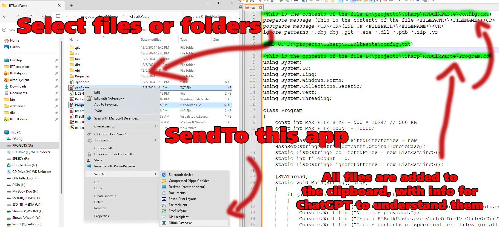

This is a tiny Windows console program utility that puts multiple text files onto your clipboard, ready to be pasted into ChatGPT.

# FEATURES #

* Converts any number of text files into a single giant text on your clipboard
* If sent a folder instead of a file, will recursively add all files/folders in it
* ignores files that are detected to be binary or over 500 KB
* Stops at 10,000 files, will detect recursion due to symbolic links
* Can ignore folders/files with wildcards, settings in config.txt
* The pre/post text between each file added can be edited in the config.txt. (Notice that it replaces <FILEPATH>, <FILENAME> and <CR> dynamically)
* Should work right with utf8 and utf16 files too
* Open source

 

# GETTING IT #

## Download the latest version (for Windows) [Here](https://www.rtsoft.com/files/RTBulkPasteWindows.zip)

# Installation

Just unzip it to its own folder somewhere

# USING FROM WINDOWS EXPLOROR

To be useful, you probably want to be able to click multiple files in File Explorer and have them all be put on the clipboard, right?

To do that, navigate to your user's SendTo directory using File Explorer (cut and paste the path below to it)

C:\Users\%username%\AppData\Roaming\Microsoft\Windows\SendTo

Now, Alt-left click (don't copy the file, we're creating a shortcut by holding Alt) and drag the RTBulkPaste.exe file there.

It will look like "RTBulkPaste.exe - Shortcut" if you did it right.  Feel free to rename the shortcut to remove the " - shortcut" part.

That's it! Now you can select files in explorer, then do Sendto->RTBulkPaste.  Now go paste that text!

# Using from the console

rtbulkpaste.exe file1.txt file2.md (etc)

# Thoughts #

I made this because I want ChatGPT's o1 mode to help me with programming, but it doesn't allow code attachements, only images.  This is a way around that until they properly allow attachements.

I looked into making this work directly from VS Code's file stuff, but it looked like I'd have to write an actual plugin, so uh, if someone does that, let me know.

It may also be of help when attachements are limited (only 6 on Claude?!) despite large enough contexts.  It could use this method to include an entire folder tree if needed.

Note, I did add an artifical one second delay so it's easier to see what it's doing.

If you aren't reading this on github, well, the C# source is on github, try https://github.com/SethRobinson

This utility was (mostly) written by ChatGTP

Dec 6th, 2024 - V1.00 Released

Seth A. Robinson
rtsoft.com